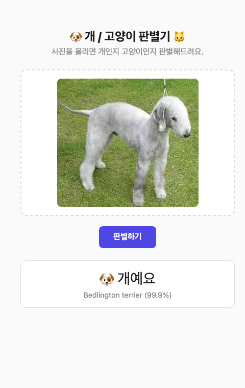

# 개 / 고양이 판별기

사진을 업로드하면 개인지 고양이인지 판별해주는 브라우저 기반 서비스입니다. 별도 서버 없이 [TensorFlow.js](https://www.tensorflow.org/js) + [MobileNet](https://github.com/tensorflow/tfjs-models/tree/master/mobilenet) 사전학습 모델을 브라우저에서 바로 실행합니다.



## 사용법

```bash
python3 -m http.server 8123
```

이후 브라우저에서 `http://localhost:8123` 접속 → 이미지를 올리거나 드래그 → "판별하기" 클릭.

## 동작 방식

1. MobileNet(ImageNet 1000개 클래스) 모델을 로드해 업로드된 이미지를 분류합니다.
2. 상위 5개 예측 중 개/고양이 관련 클래스(품종명, 고양이 종 등)와 매칭되는 것을 찾습니다.
3. 매칭된 예측의 확률이 15% 미만이면 "개나 고양이가 아닌 것 같아요"로 표시해 낮은 확신도의 오판을 방지합니다.

## 파일 구조

- [`index.html`](index.html) — 업로드/드래그앤드롭 UI
- [`style.css`](style.css) — 스타일
- [`script.js`](script.js) — 모델 로드 및 판별 로직

## 한계

- ImageNet 기반 사전학습 모델이라 개/고양이 품종이 아닌 이미지(예: 야생 고양잇과 동물)는 인식하지 못할 수 있습니다.
- 별도의 학습 없이 범용 이미지 분류 모델을 재활용한 것이라 100% 정확하지 않습니다.
